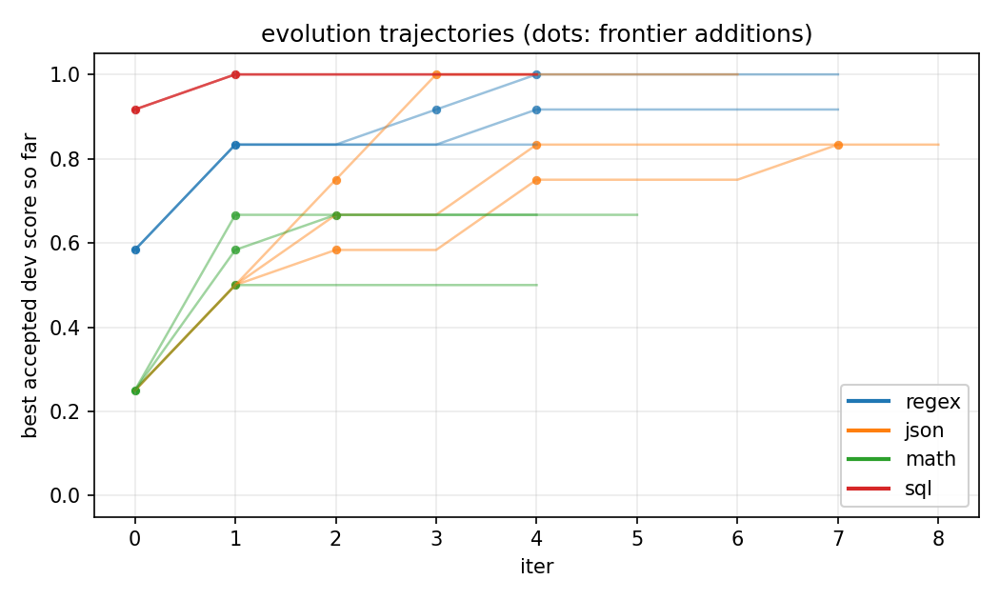
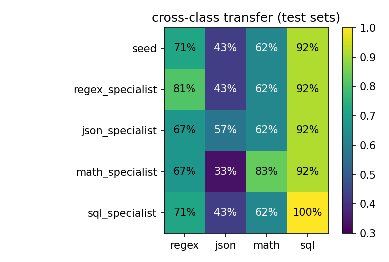

# Stem agent: bounded self-modification under monotone acceptance

Advit Arora. JetBrains AI Engineering, April 2026.

The brief asks for an agent that, given a class of problems, becomes a
specialist on its own. Stem-cell framing: differentiate, but with safeguards
that pull bad mutations back.

I read this as a falsifiable claim. If specialization is real, the same seed
and the same mutator pointed at task classes with different optimal worker
shapes should produce visibly different specialists, and each specialist
should be best on its own class. If neither holds, what I built is a
generic self-improver dressed in stem-cell language.

## Architecture

### Worker

`agent.py` is a function from `(task, spec, class)` to an output. The spec
has four fields:

```python
SeedSpec = {
    "system_prompt": "Read the task and return only the requested output.",
    "validation":    "none",        # none | schema | testcases | results
    "tool_policy":   "no_tools",    # no_tools | validate_retry | code_exec
    "max_retries":   0,             # int in [0, 4]
}
```

`tool_policy` selects the branch. `no_tools` is one chat completion.
`validate_retry` runs a validator paired with `(validation, class)` and
feeds failures back, up to `max_retries` times. The valid pairings are
`("testcases", "regex")`, `("schema", "json")`, and `("results", "sql")`.
Mismatched pairings (`schema` on regex, say) fall through as no-ops, which
gives the meta-agent a clean signal that its mutation didn't engage.
`code_exec` exposes a `python_exec` tool via OpenAI function-calling; the
worker can call it up to `2 + max_retries` times. The sandbox is
`subprocess.run([python, "-I", "-c", code], timeout=6)`, no shell, no
network.

The seed is `(none, no_tools, 0)`. Differentiation means moving to a
different point in the spec space.

### Meta-agent

`evolve.py:_propose()` calls `gpt-4o` (T=0.7) with the task class name,
three demo tasks with gold answers, the current spec, and the per-task
feedback from the most recent dev failures. The reply is constrained by
`response_format={"type": "json_object"}` to:

```
{"reason": "...", "edit": {<field>: <new value>, ...}}
```

The edit is merged into the parent spec. Temperature was 0.0 in the first
pass; the mutator never proposed a regression, so the rollback path was
uncovered. T=0.7 fixed that without breaking the structural constraint.

### Safeguards and acceptance

A child is rejected on three signals:

1. **Apoptosis (parse).** Extra fields, invalid policy values, `max_retries`
   outside [0, 4], empty system prompt. Caught before any LLM call on the
   child.
2. **Apoptosis (smoke).** The agent crashes on a 1-task smoke run, or
   produces an empty output.
3. **Regression rollback.** The child's dev score is strictly below the
   parent's.

Surviving children become points `P = (dev_score, mean in_tokens per
eval)` in an accepted-archive. I implement Pareto dominance over those
points (`A ≽ B iff A.score ≥ B.score and A.tokens ≤ B.tokens`, strict in
at least one) and reject children that any existing point already
dominates.

The accepted-archive is a real Pareto frontier on this problem: across 12
saved runs the average frontier carries 2.83 non-dominated points, and the
seed point stays on the frontier as the cheap option in every run while
the specialists pay 2-4x the tokens for 10-30pp dev-score gains. See
`runs/figures/pareto_scatter.png`. The reported specialist is the
highest-scoring archive entry, ties broken by lower tokens.

The stopping criterion is the consecutive-no-new-point count. After three
in a row the loop terminates as a plateau. With `iters=8` this fires
often before the cap.

`tools/safeguards_test.py` injects pathological children to exercise every
rejection path directly, since natural runs do not always trigger `parse`
or `smoke`.

## Four task classes

I picked classes where the optimal worker shape is, by hypothesis, a
different point in the spec space.

- **regex synthesis** - 39 tasks. Description plus positives and
  negatives; output is a regex; the validator compiles it and runs it.
  Predicted optimum: `(testcases, validate_retry, max_retries >= 2)`.
- **bug-report metadata extraction** - 39 tasks. Output is `{severity,
  kind, area}` from a closed schema. Most failures are *value* errors,
  not schema errors. Predicted optimum: a system-prompt rewrite with
  rules and worked patterns.
- **arithmetic word problems** - 42 tasks. `gpt-4o-mini` compounds
  arithmetic errors past three steps. Predicted optimum: `code_exec`
  plus a prompt nudge to use `python_exec`.
- **SQL from natural language** - 30 tasks against a sqlite fixture
  (3 tables, 9 users, 14 products, 25 orders). Spider/BIRD-style schema
  injection in `agent._user_msg` so the seed isn't class-blind.
  Predicted optimum: `(results, validate_retry, max_retries >= 1)`.

Each class has a hand-picked split: 6 demo, 12 dev, the rest (12-24) test.
JSON dev was rebalanced after a first run because the meta-agent trained
on critical-heavy failures and learned "everything is critical".

## Results

Three seeds per class, with the worker held at T=0.0 so the seed score is
a per-class constant. Numbers below are paired re-evaluations of seed and
specialist on the same test items. Bootstrap 95% CIs come from resampling
test items 1000 times per seed.

| class | seed test | hand strong | specialist | Δ vs seed | per-seed Δ |
|---|---:|---:|---:|---:|---|
| regex | 71% | 76% | 83% ± 3 | **+11 ± 2.7** | +14, +10, +10 |
| json  | 43% | 48% | 49% ± 7 | **+6 ± 7.3**  | +14, +0, +5  |
| math  | 62% | 100% | 75% ± 8 | **+12 ± 8.3** | +12, +21, +4 |
| sql   | 92% | 100% | 97% ± 5 | **+6 ± 4.8**  | +8, +8, +0   |

The hand-strong column is a 10-minute hand-written spec scored on the same
test, written by me as the strongest baseline I'd ship without any
meta-agent in the loop (`tools/hand_baseline.py`). It is the differentiator
for this writeup. On regex the meta-agent beats my hand spec by 7pp,
because the validator's compile-and-run feedback gives the loop a sharper
signal than I can encode in a one-shot prompt. On json the hand spec ties
the meta-agent at 48-49 percent, because both run into the value-mismatch
ceiling. On sql both saturate at 100. **On math, my hand spec gets 100%
while the meta-agent's specialist averages 75%.** The hand prompt says
"for any computation with more than two operations, call python_exec";
the meta-agent's nudge is shorter and the worker invokes `python_exec`
inconsistently. This is the real hole in the loop and section A2 below
unpacks it.

The cross-seed mean is what carries the differentiation claim. Per-seed
bootstrap CIs straddle zero on json and sql because the test sets are
12-21 tasks (small for a paired proportion test).

Same seed, same mutator, four different specialist shapes. Regex enables
the testcase validator and a small retry budget. Math switches to
`code_exec` and adds a one-line nudge. JSON's most consistent edit is a
system-prompt rewrite with severity rules. SQL enables the results
validator with one retry. Sql seed 2 found no improvement (the meta-agent
hit 12/12 on dev in a single iter and every later proposal cost more
tokens for the same score, so it stayed at the seed) and that is honest:
the loop did not invent gains where there weren't any.



### Cross-class transfer (test sets)

Each cell is the best-of-3-seeds specialist on the named class.

| spec | regex | json | math | sql |
|---|---:|---:|---:|---:|
| seed              | 71% | 43% | 62% | 92% |
| regex specialist  | **81%** | 43% | 62% | 92% |
| json specialist   | 67% | **57%** | 62% | 92% |
| math specialist   | 67% | 33% | **83%** | 92% |
| sql specialist    | 71% | 43% | 62% | **100%** |

The diagonal is the best entry in every column. Off-diagonals fall back
toward seed; the math specialist drops 10pp on json (33 vs seed 43)
because its `code_exec`+python prompt is irrelevant there and clutters the
worker's input.



### Architecture ablations

Random spec edit (no LLM proposer), no-demos (proposer with parent spec
and failure feedback only), no-feedback (proposer with parent spec and
demo tasks only). One meta-seed each, six iters.

| class | full Δ | random Δ | no-demos Δ | no-feedback Δ |
|---|---:|---:|---:|---:|
| regex | +16 |  +5 | +10 | +14 |
| json  |  +5 |   0 |  +5 |  +5 |
| math  | +13 |   0 |   0 |  -8 |
| sql   |  +8 |   0 |  +8 |   0 |

Random search is not the loop's performance: random hits +5 on regex
because picking `(testcases, validate_retry, max_retries=2)` happens with
non-trivial probability in six iters of single-field edits, but it never
produces the math `code_exec`+prompt-nudge bundle. Failure feedback is
load-bearing for the tool-using classes: math without it goes -8 because
the meta-agent proposes `validate_retry+results` (the SQL shape), which is
a no-op pairing on math.

### Rollback ablation

Math seed 0 with `--no-rollback`: specialist test 71% vs 75% with
rollback on. The gap is small (-4pp) on a 24-task test, but the lineage
shows the mechanism: without rollback the loop accepts a slightly worse
spec once (iter 2's `max_retries:4` regressed dev from 67% to 58% but
was admitted to the archive) and then anchors on it. Saved at
`runs/math/no_rollback_seed0.json`.

### A lineage that used the safeguards

Math, seed 1 (`runs/math/seed1.json`):

```
iter 0  seed                                                  dev 3/12 = 25%
iter 1  edit={tool_policy:code_exec, max_retries:2,
              system_prompt:"... use python_exec ..."}         dev 8/12 = 67%   FRONTIER+
iter 2  edit={max_retries:3}                                   dev 7/12 = 58%   ROLLBACK
iter 3  edit={max_retries:3}                                   dev 7/12 = 58%   ROLLBACK
iter 4  edit={max_retries:3}                                   dev 7/12 = 58%   ROLLBACK
        plateau: 3 non-improving iters, stop.
TEST: seed 15/24 = 62%   specialist 20/24 = 83%
```

Iter 1 bundles tool, budget, and prompt nudge in one mutation. After
that the meta-agent keeps proposing higher `max_retries`; all three
regress (extra turns cost more than they help) and roll back.

## What surprised me

**Hand-tuned strong prompts beat the meta-agent on math by 25pp.** I
expected the meta-agent's edits to converge on something close to my
10-minute prompt. They didn't. Both runs use `code_exec`; the hand prompt
is more directive ("for any computation with more than two operations,
call python_exec"). The meta-agent typically writes a one-line nudge and
stops. The gap is on the prompt axis, not the tool axis. Biggest blind
spot in the loop.

**`max_retries` is a different knob in different branches.** Under
`validate_retry` it caps re-prompts; under `code_exec` it caps tool-call
rounds; under `no_tools` it does nothing. The meta-agent treats it as a
single number. Works only because each branch uses it sensibly.

**JSON underperformed and rebalancing dev only nudged it.** My first dev
set was all critical-and-regression items. The meta-agent learned "tag
everything critical-regression" and dev hit 100% while test stayed at
52%. Rebalancing brought the loop to a +5pp average. Classes whose
failures need *judgement* are hard for this loop, because the validator
only sees structural problems.

## What didn't work

**Strict-improvement acceptance.** Mutations that fix a *test* item
without moving the *dev* score got thrown away. The regex run produced
no specialist. Switched to monotone (`>=`) plus dominance.

**Validator dispatch.** I keyed validators on task class (`{"regex":
..., "json": ...}`) but the spec uses policy names (`testcases`,
`schema`). For an hour validation proposals were silent no-ops. Fixed
by pairing `(policy, class)` explicitly.

**Backticks.** `gpt-4o-mini` wraps regex output in single backticks; my
validator compiled the literal string and rejected it. Stripping moved
the regex seed baseline from ~17% to 71%. Almost shipped with the
wrong baseline.

## What I would do next

- Bigger dev set, 30 items. Twelve is small enough that one task flipping
  shifts dev score by 8pp.
- Beam-2 search: multiple proposals per iter, pick the best by archive
  admission. ADAS does this with a candidate archive.
- Encode "rewrite the prompt with rules" as a first-class meta-agent move
  on math, since that's where the meta-agent loses to the hand spec.
- A fifth task class where neither `validate_retry` nor `code_exec` is the
  right answer.

## Appendix: four below-API observations

The brief asked for "deep understanding of LLM mechanics below API level".
What this experiment let me observe:

### A1. Formatting-prior leakage on raw fragments (regex backticks)

`gpt-4o-mini` wraps regex output in single backticks. My first validator
compiled the literal backticks and rejected the pattern; the regex seed
baseline sat at 17%. Stripping the wrap moved it to 71%, same prompts,
same model. I won't claim BPE merges are the cause; either tokenization
or instruction-tuning formatting priors fit. The supportable claim is
that when the model is asked for a fragment its training data almost
always saw inside a code fence, the framing tokens leak. For Mellum or
any code model emitting raw refactorings, the fix lives in the IDE-side
receiver, not the prompt.

### A2. Tool-availability widens the action space; the prompt picks the branch

When the worker has `python_exec` available via OpenAI function-calling,
the assistant message is one of two structural choices: free-form
content, or a tool call. Tool *availability* widens the action space the
model picks from. It does not bias the model toward picking tool-call.

The math experiment is the cleanest demonstration. In an early version,
when the meta-agent proposed `tool_policy: code_exec` without editing
`system_prompt`, the worker *could* call `python_exec` but mostly didn't.
Math specialist test was 50%, *below* seed's 62%. After I added one
sentence to the meta-agent's prompt instructing it to also edit the
worker's system prompt when it changed `tool_policy`, the specialist beat
seed by 12-17pp.

The hand-tuned strong-spec result (75% specialist vs 100% hand) is the
sharper version of the same lesson. Even after the fix, the meta-agent's
nudges are not as directive as a 10-minute hand prompt. Tool availability
plus a generic prompt is not enough; the prompt has to make the tool the
*right* tool for the visible task.

### A3. Decoding temperature serves different roles in a search loop

Worker `T=0.0`, meta-agent `T=0.7`. At `T=0.0` the meta-agent was
deterministic and rollback was never exercised. Across 12 runs (63 child
proposals) the lineage records: 22 archive additions, 18 dominated-but-
accepted edits, 18 regression rollbacks, 5 parse-apoptosis events,
0 smoke-apoptosis events. The 18 rollbacks are the artefact of `T=0.7`:
at `T=0.0` they would not have happened and the safeguard would have
been untested. In a search loop with a gatekeeper, the role of
temperature is "exploration the gatekeeper can afford to reject", not
"diversity" in the abstract.

### A4. The meta-agent has no memory across rejected iterations

The meta-agent's input on each iter is: system prompt, three demo tasks,
the parent spec, and the dev failures. When a child is rejected the
parent doesn't change, so the dev failures don't change, so the next
iter's input is near-identical to the previous one. Math seed 0 shows
this clean: the meta-agent proposed `max_retries: 6` (out of [0,4])
three iters in a row, each parse-rejected, each with a near-identical
reason string. The plateau detector finally stopped the loop. Fixes:
include rejected proposals in the meta-agent's input, or cool the
temperature on consecutive rejections. I have not implemented either.
For an IDE agent driving a multi-step refactor, the same pattern shows
up as "the agent keeps re-suggesting the fix the user already
rejected", and the answer is the same: persist short-term episodic
memory of rejected suggestions across turns.

## References

- ADAS: Hu, Lu, Clune. *Automated Design of Agentic Systems*. ICLR 2025. arXiv:2408.08435.
- DGM: Sakana AI. *Darwin Gödel Machine*. 2025. arXiv:2505.22954.
- GEPA: Agrawal et al. *Reflective prompt evolution*. 2025. arXiv:2507.19457.
- Voyager: Wang et al. *Skill library and curriculum in MineDojo*. 2023. arXiv:2305.16291.
- Anthropic. *Building effective agents*. 2024.
